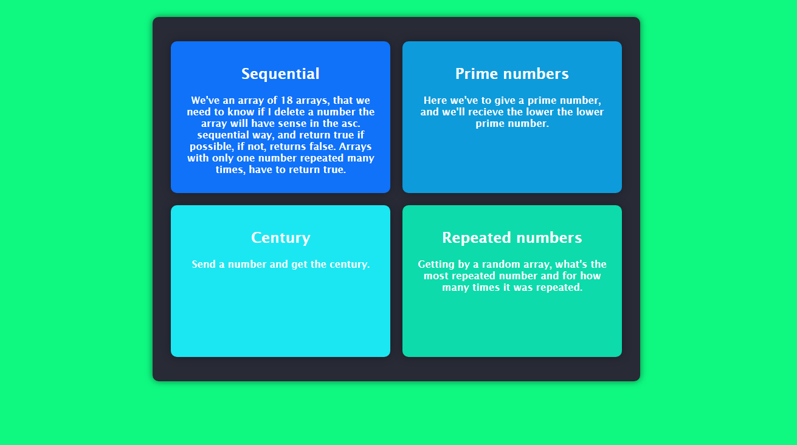

# Programming-logic-exercises
Sometimes I code some algorithms to university or job interview tests, but I never show it to everybody else. So I decide to create this, a portfolio-like page that I use to show my non-published code (that haven't GitHub repositories) to recruiters who want to see my programming skills.

I thought if I publish my used codes instead delete, will be better used. I'll use this repository to publish my simples codes, better projects I publish in a real portfolio.

## You don't need to open the files to see the code, just run the repo

<h3>Just type in the root folder of the repository:</h3>
$ php -S localhost:8000